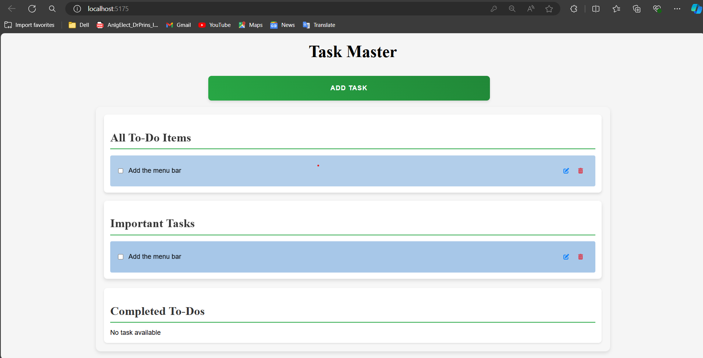
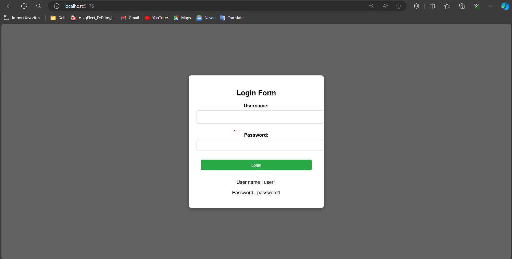
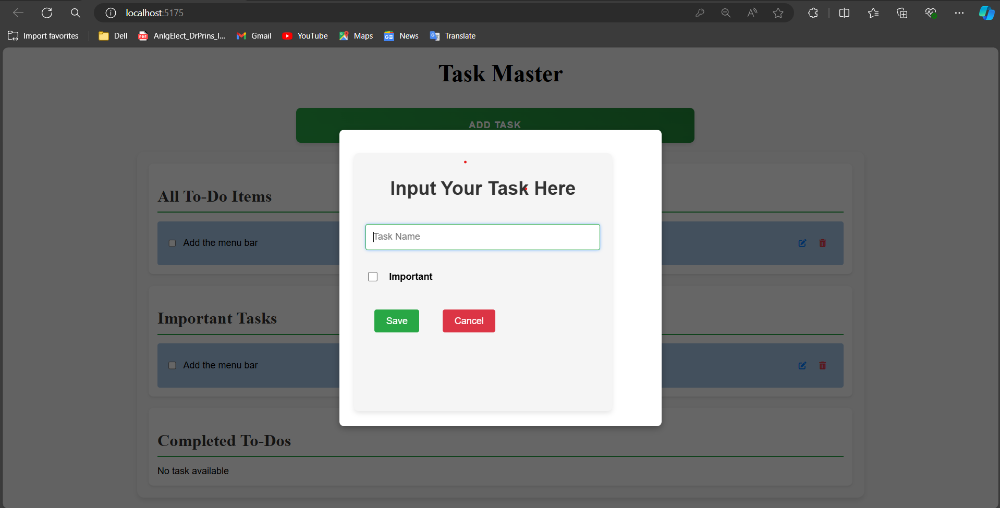

# ToDoApp

## c# .NET ReactJS and TypeScript SQLite

## Overview

The ToDoApp is a task management application designed to enhance productivity and organization. It allows users to create, update, prioritize, and track the completion of tasks. The application is powered by a backend API built with C# .NET and SQLite, and a responsive frontend developed using ReactJS and TypeScript.

## Features

- **CRUD Operations**: Create, read, update, and delete tasks.
- **Important Task Management**: Mark tasks as important for prioritization.
- **Completed Tasks List**: View tasks that have been marked as completed.
- **Responsive UI**: Enjoy a seamless and user-friendly interface across various devices.
- **Real-time Updates**: Get real-time updates to your task list.


### Home Page


### Login Page


### Add Task


## Prerequisites

Ensure you have the following tools installed on your system:

- **Node.js**: Version 20.x or higher. [Download Node.js](https://nodejs.org/)
- **.NET SDK**: Version 8.x or higher. [Download .NET SDK](https://dotnet.microsoft.com/download)

## Setup Instructions

### Backend Setup

1. **Clone the Repository**

   ```bash
   git clone https://github.com/dilen1999/ToDoApp

   ```

## Backend Setup

### Restore Dependencies

Restore the necessary .NET packages:

```bash
dotnet restore
```

3. **Update the Database:**

   Apply database migrations to set up the SQLite database:

   ```bash
   dotnet ef database update
   ```

4. **Run the Application:**

   Start the backend server:

   ```bash
   dotnet run
   ```

5. **Access API Documentation:**

   Open your browser and navigate to the Swagger UI for API documentation:

   ```
   http://localhost:5053/swagger/index.html
   ```

### Frontend Setup

1. **Navigate to the Frontend Directory:**

   Change to the frontend project directory:

   ```bash
   cd ../frontend
   ```

2. **Install Dependencies:**

   Install the necessary packages:

   ```bash
   # For Yarn
   yarn install

   # For npm
   npm install
   ```

3. **Run the Development Server:**

   Start the frontend development server:

   ```bash
   # For npm
   npm run dev

   # For Yarn
   yarn dev
   ```

4. **Access the Frontend Application:**

   Open your browser and navigate to:

   ```
   http://localhost:5174
   ```

### Running the Application

To run the entire application locally, follow these steps:

1. **Start the Backend:**

   In the `backend/TodoApi` directory, start the backend server:

   ```bash
   dotnet run
   ```

2. **Start the Frontend:**

   In the `frontend/todo-app` directory, start the frontend development server using your preferred package manager:

   ```bash
   # For npm
   npm run dev

   # For Yarn
   yarn dev

   ```

3. **Access the Application:**

   Open your browser and navigate to the following URLs:

   - **Frontend Application:**
     ```
     http://localhost:5174
     ```
   - **Swagger API Documentation:**
     ```
     http://localhost:5053/swagger/index.html
     ```

Follow the above steps in a sequence manner to run the ToDoApp.
